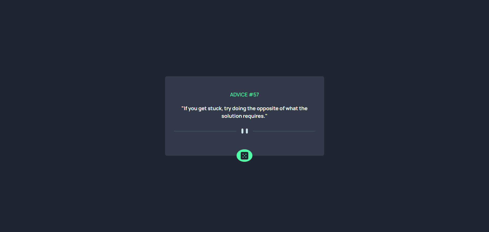

# 🧠 Gerador de Conselhos

Aplicação web desenvolvida com Angular e Bootstrap que consome a [Advice Slip API](https://api.adviceslip.com/) para exibir conselhos aleatórios de forma dinâmica e responsiva.

## 📸 Demonstração

## 🚀 Tecnologias Utilizadas

- Angular
- Bootstrap
- Advice Slip API

## 🎯 Funcionalidades

- Exibe conselhos aleatórios com seus respectivos IDs.
- Atualiza o conselho ao recarregar a página ou ao clicar no botão.
- Design responsivo adaptado para diferentes tamanhos de tela.

